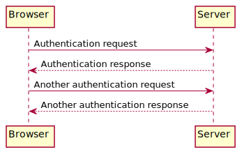
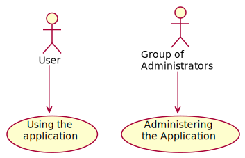

Unified Modeling Language (UML)
===============================

Installation
------------

#. Install `plantuml <https://plantuml.com/starting>`_:

   .. tab:: Linux

       .. code-block:: console

         $ sudo apt install plantuml

   .. tab:: macOS

      .. code-block:: console

         $ brew install plantuml

   .. tab:: Windows

      .. code-block:: ps1

         $ choco install plantuml

#. Install `sphinxcontrib-plantuml
   <https://pypi.org/project/sphinxcontrib-plantuml/>`_:

   .. tab:: Linux

      .. code-block:: console

         $ python -m pip install sphinxcontrib-plantuml

   .. tab:: macOS

      .. code-block:: console

         $ python -m pip install sphinxcontrib-plantuml

   .. tab:: Windows

      .. code-block:: ps1con

         C:> python -m pip install sphinxcontrib-plantuml

#. Configure Sphinx in the ``conf.py`` file:

   .. code-block:: python

      extensions = [..., "sphinxcontrib.plantuml"]

      plantuml = "/PATH/TO/PLANTUML"

   .. note::
      Also in Windows, the path is specified with ``/``.

Sequence diagram
----------------

.. code-block:: rest

   .. uml::

      Browser -> Server: Authentication request
      Server --> Browser: Authentication response

      Browser -> Server: Another authentication request
      Browser <-- Server: Another authentication response

``->``
    is used to draw a message between two actors. The actors do not have to be
    explicitly declared.
``-->``
     is used to draw a dotted line.
``<- und <--``
    do not change the drawing, but can increase readability.

Use case diagram
----------------

.. code-block:: rest

   .. uml::

      :User: --> (usage)
      "Group of\nAdministrators" as Admin
      "Using the\napplication" as (usage)
      Admin --> (Administrate\nthe application)

Use cases are enclosed in round brackets ``()`` and resemble an oval.

Alternatively, the keyword ``usecase`` can also be used to define a use case. It
is also possible to define an alias using the keyword ``as``. This alias can
then be used when defining relationships.

You can use ``\n`` to insert line breaks in the names of the use cases.

Activity diagram
----------------

``(*)``
    Start and end nodes of an activity diagram.

    ``(*top)``
        In some cases, this can be used to move the start point to the beginning
        of a diagram.

``-->``
    defines an activity

    ``-down->``
        down arrow (default value)
    ``-right-> or ->``
        arrow to the right
    ``-left->``
        Arrow to the left
    ``-up->``
        Arrow up

``if``, ``then``, ``else``
    Keywords for the definition of branches.

    Example:

    .. code-block:: rest

       .. uml::

           (*) --> "Initialisation"
           if ‘a test’ then
           -->[true] "An activity"
           --> "Another activity"
           -right-> (*)
           else
           ->[false] "Something else"
           -->[end of the process] (*)
           endif

    .. image:: activity-diagram.svg

``fork``, ``fork again`` and ``end fork`` or ``end merge``
    Keywords for parallel processing.

    Example:

    .. code-block:: rest

       .. uml::

          start
          fork
            :Action 1;
          fork again
            :Action 2;
          end fork
          stop

    .. image:: parallel.svg
