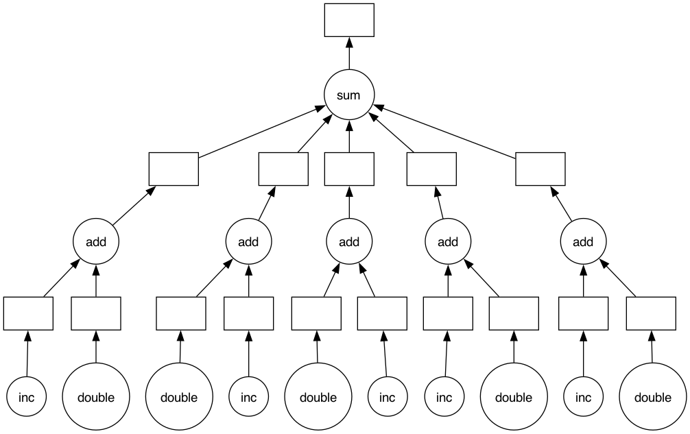

Decorators
==========

Functions can also be passed as arguments to other functions, and the results of
other functions can be returned. For example, it is possible to write a Python
function that takes another function as a parameter, embeds it within another
function that does something similar, and then returns the new function. This
new combination can then be used in place of the original function:

.. code-block:: pycon
   :linenos:

   >>> def inf(func):
   ...     print("Information about", func.__name__)
   ...     def details(*args):
   ...         print("Execute function", func.__name__, "with the argument(s)")
   ...         return func(*args)
   ...     return details
   ...
   >>> def my_func(*params):
   ...     print(params)
   ...
   >>> my_func = inf(my_func)
   Information about my_func
   >>> my_func("Hello", "Pythonistas!")
   Execute function my_func with the argument(s)
   ('Hello', 'Pythonistas!')

Line 1
    The ``inf`` function prints the name of the function it wraps.
Line 12
    When it has finished, the ``inf`` function returns the wrapped function.

A decorator is `syntactic sugar
<https://en.wikipedia.org/wiki/Syntactic_sugar>`_ for this process and allows
you to wrap one function around another with a single line of code. You still
get exactly the same effect as with the previous code, but the resulting code is
much cleaner and easier to read. Using a decorator simply consists of two parts:

#. defining the function that is to wrap or decorate other functions, and
#. using an ``@``, followed by the decorator, immediately before the wrapped
   function is defined.

The decorator function should take a function as a parameter and return a
function, as follows:

.. code-block:: pycon
   :linenos:

   >>> @inf
   ... def my_func(*params):
   ...     print(params)
   ...
   Information about my_func
   >>> my_func("Hello", "Pythonistas!")
   Execute function my_func with the argument(s)
   ('Hello', 'Pythonistas!')

Line 1
    The function ``my_func`` is decorated with ``@inf``.
Line 8
    The wrapped function is called once the decorator function has finished.

``functools``
-------------

The Python :mod:`functools` module is designed for higher-order functions, that
are functions which act on or return other functions. You can usually use them
as decorators, for example:

:func:`functools.cache`
    A simple, lightweight cache for functions in Python 3.9 and later, sometimes
    also referred to as *memoize*. It returns the same result as
    :func:`functools.lru_cache` with the parameter ``maxsize=None``, whilst
    additionally creating a :doc:`/types/dicts` containing the function
    arguments. As old values never need to be deleted, this function is
    therefore smaller and faster. An example:

    .. code-block:: pycon
       :linenos:

       >>> from timeit import timeit
       >>> from functools import cache
       >>> @cache
       ... def factorial(n):
       ...     return n * factorial(n - 1) if n else 1
       ...
       >>> timeit("factorial(10)", number=1, globals=globals())
       8.74977558851242e-06
       >>> timeit("factorial(12)", number=1, globals=globals())
       4.041939973831177e-06
       >>> timeit("factorial(12)", number=1, globals=globals())
       1.8328428268432617e-06

    Line 1
        imports the :mod:`timeit` module to measure execution time.
    Line 2
        imports :func:`functools.cache`.
    Line 3
        The ``@cache`` decorator is used to store intermediate results, which
        can then be reused. In our case, this increases the execution speed by a
        factor of approximately ten.
    Line 7
        :func:`timeit.timeit` measures the time taken for a call.
    Line 9
        Only two further recursive calls need to be made, as ``factorial(10)``
        is already cached.

:func:`functools.singledispatch`
    converts a function into a generic function. To define a generic function,
    it is decorated with the ``@singledispatch`` decorator:

    .. code-block:: pycon

       >>> from functools import singledispatch
       >>>
       >>> @singledispatch
       ... def multiply(a, b):
       ...     raise NotImplementedError("Unsupported type")
       ...

    To add overloaded implementations to the function, you can use
    :func:`register` on the generic function as a decorator:

    .. code-block:: pycon

       >>> @multiply.register(float)
       ... def _(a, b):
       ...     print(a * b)
       ...
       >>> @multiply.register(str)
       ... def _(a, b):
       ...     print(float(a) * float(b))
       ...
       >>> multiply(7.0, 0.6)
       4.2
       >>> multiply("7.0", "0.6")
       4.2

    For functions annotated with types, the decorator automatically infers the
    type of the first argument.

:func:`functools.wraps`
    This decorator ensures that the wrapped function looks exactly like the
    original function, with its name and attributes intact.

    .. code-block:: pycon

        >>> from functools import wraps
        >>> def my_decorator(f):
        ...     @wraps(f)
        ...     def wrapper(*args, **kwargs):
        ...         """Wrapper docstring"""
        ...         print("Call decorated function")
        ...         return f(*args, **kwargs)
        ...     return wrapper
        ...
        >>> @my_decorator
        ... def example():
        ...     """Example docstring"""
        ...     print("Call example function")
        ...
        >>> example.__name__
        'example'
        >>> example.__doc__
        'Example docstring'

    Without the ``@wraps`` decorator, the name and docstring of the ``wrapper``
    method would have been returned instead:

    .. code-block:: pycon

        >>> example.__name__
        'wrapper'
        >>> example.__doc__
        'Wrapper docstring'

Other typical uses for Python decorators
----------------------------------------

Other Python compilers
~~~~~~~~~~~~~~~~~~~~~~

Python compilers such as `Numba <https://numba.pydata.org/>`_ can be used with a
decorator:

.. code-block:: python

   @numba.jit(nopython=True)
   def dist(x, y):
       """Calculate the distance"""
       dist = 0
       for i in range(len(x)):
           dist += (x[i] - y[i]) ** 2
       return dist

.. seealso::
   * :ref:`/performance/index.rst#numba`

Parallelisation
~~~~~~~~~~~~~~~

The sequential execution of independent pipeline steps does not make optimal use
of the processing power of processors. The `@dask.delayed
<https://docs.dask.org/en/stable/delayed.html#decorator>`_ decorator creates a
directed acyclic graph (DAG) to execute the tasks in parallel, which helps to
reduce the overall execution time:

.. code-block:: pycon

   >>> import dask
   >>> @dask.delayed
   ... def inc(x):
   ...     return x + 1
   ...
   >>> @dask.delayed
   ... def double(x):
   ...     return x * 2
   ...
   >>> @dask.delayed
   ... def add(x, y):
   ...     return x + y
   ...
   >>> data = range(1, 6)
   >>> output = []
   >>> for x in data:
   ...     a = inc(x)
   ...     b = double(x)
   ...     c = add(a, b)
   ...     output.append(c)
   ...
   >>> total = dask.delayed(sum)(output)
   >>> total.compute()
   50
   >>> total.visualize()
   <IPython.core.display.Image object>

Memory profiling
~~~~~~~~~~~~~~~~

The ``@memory_profiler.profile`` decorator is used to measure memory usage. It
monitors the enclosed function step by step, tracking RAM usage or the amount of
memory released at each individual step:

.. code-block:: python
   :linenos:

   from memory_profiler import profile

   @profile
   def my_func():
       a = [1] * (10**6)
       b = [2] * (2 * 10**7)
       del b
       return a

The output might look like this:

.. code-block:: console

   Line #    Mem usage    Increment   Line Contents
   ================================================
        4     67.3 MiB     67.3 MiB   @profile
        5                             def my_func():
        6     74.8 MiB      7.5 MiB       a = [1] * (10 ** 6)
        7    227.4 MiB    152.6 MiB       b = [2] * (2 * 10 ** 7)
        8     74.9 MiB      0.0 MiB       del b
        9     74.9 MiB      0.0 MiB       return a

.. seealso::
   * `memory-profiler
     <https://www.python4data.science/de/latest/performance/ipython-profiler.html#Speicherprofil-erstellen:-%memit-und-%mprun>`_
