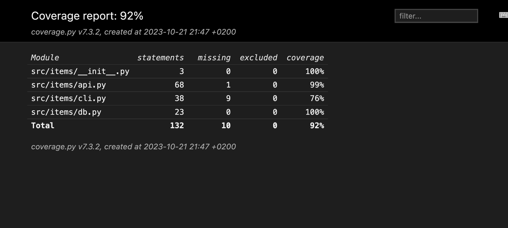
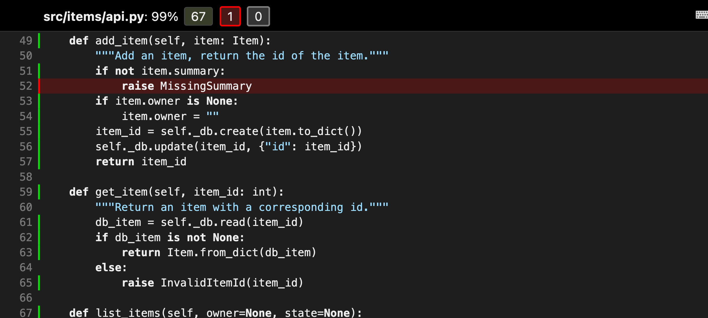

Coverage
========

We have created an initial list of test cases. The tests in the :file:`tests/api`
directory test Items via the API. But how do we know whether these tests
comprehensively test our code? This is where code coverage comes into play.

Tools that measure code coverage observe your code while a test suite is running
and record which lines are passed and which are not. This measure – known as line
coverage – is calculated by dividing the total number of executed lines by the
total number of lines of code. Code coverage tools can also tell you whether all
paths in control statements are traversed, a measurement known as branch
coverage.

However, code coverage cannot tell you if your test suite is good; it can only
tell you how much of the application code is being traversed by your test suite.

`Coverage.py <https://coverage.readthedocs.io/en/latest/>`_ is the favourite
Python tool that measures code coverage. And `pytest-cov
<https://pytest-cov.readthedocs.io/en/latest/>`_ is a popular :doc:`pytest plugin
<pytest/plugins>` that is often used in conjunction with Coverage.py.

Using Coverage.py with pytest-cov
---------------------------------

Both Coverage.py and pytest-cov are third-party packages that must be installed
before use:

You can create a report for the test coverage with Coverage.py.

.. tab:: Linux/macOS

   .. code-block:: console

      $ bin/python -m pip install coverage pytest-cov

.. tab:: Windows

   .. code-block:: ps1con

      C:> Scripts\python -m pip install coverage pytest-cov

.. note::
   If you want to determine the test coverage for Python 2 and Python<3.6, you
   must use Coverage<6.0.

To run tests with Coverage.py, you need to add the ``--cov`` option and specify
either a path to the code you want to measure or the installed package you are
testing. In our case, the Items project is an installed package, so we will test
it with ``--cov=items``.

The normal pytest output is followed by the coverage report, as shown here:

.. code-block:: pytest

    $ cd /PATH/TO/items
    $ python3 -m venv .
    $ . bin/activate
    $ python -m pip install ".[dev]"
    $ pytest --cov=items
    ============================= test session starts ==============================
    ...
    rootdir: /Users/veit/cusy/prj/items
    configfile: pyproject.toml
    testpaths: tests
    plugins: cov-4.1.0, Faker-19.11.0
    collected 35 items

    tests/api/test_add.py ....                                               [ 11%]
    tests/api/test_config.py .                                               [ 14%]
    tests/api/test_count.py ...                                              [ 22%]
    tests/api/test_delete.py ...                                             [ 31%]
    tests/api/test_finish.py ....                                            [ 42%]
    tests/api/test_list.py .........                                         [ 68%]
    tests/api/test_start.py ....                                             [ 80%]
    tests/api/test_update.py ....                                            [ 91%]
    tests/api/test_version.py .                                              [ 94%]
    tests/cli/test_add.py ..                                                 [100%]

    ---------- coverage: platform darwin, python 3.11.5-final-0 ----------
    Name                    Stmts   Miss  Cover
    -------------------------------------------
    src/items/__init__.py       3      0   100%
    src/items/api.py           70      1    99%
    src/items/cli.py           38      9    76%
    src/items/db.py            23      0   100%
    -------------------------------------------
    TOTAL                     134     10    93%

    ============================== 35 passed in 0.11s ==============================

The previous output was generated by coverage’s reporting functions, although we
did not call coverage directly. ``pytest --cov=items`` instructed the
``pytest-cov`` plugin to

* set ``coverage`` to ``items`` with ``--source`` while running pytest with the
  tests
* execute ``coverage`` report for the line coverage report

Without ``pytest-cov``, the commands would look like this:

.. code-block:: console

    $ coverage run --source=items -m pytest
    $ coverage report

The files :file:`__init__.py` and :file:`db.py` have a coverage of 100%, which
means that our test suite hits every line in these files. However, this does not
tell us that it is sufficiently tested or that the tests detect possible errors;
but it at least tells us that every line was executed during the test suite.

The :file:`cli.py` file has a coverage of 76%. This may seem surprisingly high as
we have not tested the CLI at all. However, this is due to the fact that
:file:`cli.py` is imported by :file:`__init__.py`, so that all function
definitions are executed, but none of the function contents.

However, we are really interested in the :file:`api.py` file with 99% test
coverage. We can find out what was missed by re-running the tests and adding the
``--cov-report=term-missing`` option:

.. code-block:: pytest

    pytest --cov=items --cov-report=term-missing
    ============================= test session starts ==============================
    ...
    rootdir: /Users/veit/cusy/prj/items
    configfile: pyproject.toml
    testpaths: tests
    plugins: cov-4.1.0, Faker-19.11.0
    collected 35 items

    tests/api/test_add.py ....                                               [ 11%]
    tests/api/test_config.py .                                               [ 14%]
    tests/api/test_count.py ...                                              [ 22%]
    tests/api/test_delete.py ...                                             [ 31%]
    tests/api/test_finish.py ....                                            [ 42%]
    tests/api/test_list.py .........                                         [ 68%]
    tests/api/test_start.py ....                                             [ 80%]
    tests/api/test_update.py ....                                            [ 91%]
    tests/api/test_version.py .                                              [ 94%]
    tests/cli/test_add.py ..                                                 [100%]

    ---------- coverage: platform darwin, python 3.11.5-final-0 ----------
    Name                    Stmts   Miss  Cover   Missing
    -----------------------------------------------------
    src/items/__init__.py       3      0   100%
    src/items/api.py           68      1    99%   52
    src/items/cli.py           38      9    76%   18-19, 25, 39-43, 51
    src/items/db.py            23      0   100%
    -----------------------------------------------------
    TOTAL                     132     10    92%

    ============================== 35 passed in 0.11s ==============================

Now that we have the line numbers of the untested lines, we can open the files in
an editor and view the missing lines. However, it is easier to look at the HTML
report.

.. seealso::
   * `pytest-cov’s documentation <https://pytest-cov.readthedocs.io/>`_

Generate HTML reports
~~~~~~~~~~~~~~~~~~~~~

With Coverage.py we can generate HTML reports to view the coverage data in more
detail. The report is generated either with the option ``--cov-report=html`` or
by executing coverage html after a previous coverage run:

.. code-block:: console

    $ cd /PATH/TO/items
    $ python3 -m venv .
    $ . bin/acitvate
    $ python -m pip install ".[dev]"
    $ pytest --cov=items --cov-report=html

Both commands will prompt Coverage.py to create an HTML report in the
:file:`htmlcov/` directory. Open :file:`htmlcov/index.html` with a browser and
you should see the following:

If you click on the :file:`src/items/api.py:` file, a report for this file is
displayed:

.. image:: api.png
   :alt:  Coverage for src/items/api.py: 99%

The upper part of the report shows the percentage of rows covered (99%), the
total number of statements (68) and how many statements were executed (67),
missed (1) and excluded (0). Click on :menuselection:`missing` to highlight the
rows that were not executed:

It looks like the function :func:`add_item()` has an exception
``MissingSummary``, which is not tested yet.

Exclude code from test coverage
~~~~~~~~~~~~~~~~~~~~~~~~~~~~~~~

In the HTML reports you will find a column with the specification *0 excluded*.
This refers to a function of Coverage.py that allows us to exclude some lines
from the check. We do not exclude anything in items. However, it is not uncommon
for some lines of code to be excluded from the test coverage calculation, for
example modules that are to be both imported and executed directly may contain a
block that looks something like this:

.. code-block:: python

    if __name__ == '__main__':
        main()

This command tells Python to execute :func:`main()` when we call the module
directly with ``python my_module.py``, but not to execute the code when the
module is imported. These types of code blocks are often excluded from testing
with a simple pragma statement:

.. code-block:: python

    if __name__ == '__main__': # pragma: no cover
        main()

This instructs Coverage.py to exclude either a single line or a block of code.
If, as in this case, the pragma is in the ``if`` statement, you do not have to
insert it into both lines of code.

Alternatively, this can also be configured for all occurrences:

.. tab:: :file:`.coveragerc`

   .. code-block:: ini

      [run]
      branch = True

      [report]
      ; Regexes for lines to exclude from consideration
      exclude_also =

          ; Don’t complain if tests don’t hit defensive assertion code:
          raise AssertionError
          raise NotImplementedError

          ; Don't complain if non-runnable code isn’t run:
          if __name__ == .__main__.:

      ignore_errors = True

      [html]
      directory = coverage_html_report

.. tab:: :file:`pyproject.toml`

   .. code-block:: toml

      [tool.coverage.run]
      branch = true

      [tool.coverage.report]
      # Regexes for lines to exclude from consideration
      exclude_also = [
          # Don’t complain if tests don’t hit defensive assertion code:
          "raise AssertionError",
          "raise NotImplementedError",

          # Don’t complain if non-runnable code isn’t run:
          "if __name__ == .__main__.:",
          ]

      ignore_errors = true

      [tool.coverage.html]
      directory = "coverage_html_report"

.. tab:: :file:`setup.cfg`, :file:`tox.ini`

   .. code-block:: ini

      [coverage:run]
      branch = True

      [coverage:report]
      ; Regexes for lines to exclude from consideration
      exclude_also =

          ; Don’t complain if tests don’t hit defensive assertion code:
          raise AssertionError
          raise NotImplementedError

          ; Don’t complain if non-runnable code isn’t run:
          if __name__ == .__main__.:

      ignore_errors = True

      [coverage:html]
      directory = coverage_html_report

.. seealso::
   `Configuration reference
   <https://coverage.readthedocs.io/en/latest/config.html>`_

Extensions
----------

In `Coverage.py plugins
<https://gist.github.com/nedbat/2e9dbf7f33b1e0e857368af5c5d06202>`_ you will also
find a number of extensions for Coverage.

.. _coverage-github-actions:

Test coverage of all tests with GitHub actions
----------------------------------------------

After you have checked the test coverage, you can upload the files as GitHub
actions, for example in a :download:`ci.yaml` as artefacts, so that you can reuse
them later in other jobs:

.. literalinclude:: ci.yaml
   :language: yaml
   :lines: 47-52
   :lineno-start: 47

``if-no-files-found: ignore``
    is useful if you don’t want to measure the test coverage for all Python
    versions in order to get results faster. You should therefore only upload the
    data for those elements of your matrix that you want to take into account.

After all the tests have been run, you can define another job that summarises the
results:

.. literalinclude:: ci.yaml
   :language: yaml
   :lines: 54-92
   :lineno-start: 54

``needs: tests``
    ensures that all tests are performed. If your job that runs the tests has a
    different name, you will need to change it here.
``name: "Download coverage data"``
    downloads the test coverage data that was previously uploaded with ``name:
    "Upload coverage data"``.
``name: "Combine coverage and fail it it’s under 100 %"``
    combines the test coverage and creates an HTML report if the condition
    ``--fail-under=100`` is met.

Once the workflow is complete, you can download the HTML report under
:menuselection:`YOUR_REPO --> Actions --> tests --> Combine and check coverage`.

.. seealso::
   * `How to Ditch Codecov for Python Projects
     <https://hynek.me/articles/ditch-codecov-python/>`_
   * `structlog main.yml
     <https://github.com/hynek/structlog/blob/main/.github/workflows/ci.yml>`_

.. _coverage-badge:

Badge
-----

You can use GitHub Actions to create a badge with your code coverage. A GitHub
Gist is also required to store the parameters for the badge, which is rendered by
`shields.io <https://shields.io>`_. To do this, we extend our :download:`ci.yaml`
as follows:

.. literalinclude:: ci.yaml
   :language: yaml
   :lines: 94-
   :lineno-start: 94

Line 97
    ``GIST_TOKEN`` is a personal GitHub access token.
Line 98
    You should replace ``YOUR_GIST_ID`` with your own Gist ID. If you don’t have
    a Gist ID yet, you can create one with:

    #. Call up https://gist.github.com and create a new gist, which you can name
       :file:`test.json`, for example. The ID of the gist is the long
       alphanumeric part of the URL that you need here.
    #. Then go to https://github.com/settings/tokens and create a new token with
       the gist area.
    #. Finally, go to :menuselection:`YOUR_REPO --> Settings --> Secrets -->
       Actions` and add this token. You can give it any name you like, for
       example :samp:`{GIST_SECRET}`.

       If you use `Dependabot <https://github.com/dependabot>`_ to automatically
       update the dependencies of your repository, you must also add the
       :samp:`{GIST_SECRET}` in :menuselection:`YOUR_REPO --> Settings -->
       Secrets --> Dependabot`.

Lines 102-104
    The badge is automatically coloured:

    * ≤ 50 % in red
    * ≥ 90 % in green
    * with a colour gradient between the two

Now the badge can be displayed with a URL like this:
:samp:`https://img.shields.io/endpoint?url=https://gist.githubusercontent.com/YOUR_GITHUB_NAME/GIST_SECRET/raw/covbadge.json`.

.. image:: https://img.shields.io/endpoint?url=https://gist.githubusercontent.com/nedbat/a27aaed4944c1f760a969a543fb52767/raw/covbadge2_40.json
.. image:: https://img.shields.io/endpoint?url=https://gist.githubusercontent.com/nedbat/a27aaed4944c1f760a969a543fb52767/raw/covbadge2_45.json
.. image:: https://img.shields.io/endpoint?url=https://gist.githubusercontent.com/nedbat/a27aaed4944c1f760a969a543fb52767/raw/covbadge2_50.json
.. image:: https://img.shields.io/endpoint?url=https://gist.githubusercontent.com/nedbat/a27aaed4944c1f760a969a543fb52767/raw/covbadge2_55.json
.. image:: https://img.shields.io/endpoint?url=https://gist.githubusercontent.com/nedbat/a27aaed4944c1f760a969a543fb52767/raw/covbadge2_60.json
.. image:: https://img.shields.io/endpoint?url=https://gist.githubusercontent.com/nedbat/a27aaed4944c1f760a969a543fb52767/raw/covbadge2_65.json
.. image:: https://img.shields.io/endpoint?url=https://gist.githubusercontent.com/nedbat/a27aaed4944c1f760a969a543fb52767/raw/covbadge2_70.json
.. image:: https://img.shields.io/endpoint?url=https://gist.githubusercontent.com/nedbat/a27aaed4944c1f760a969a543fb52767/raw/covbadge2_75.json
.. image:: https://img.shields.io/endpoint?url=https://gist.githubusercontent.com/nedbat/a27aaed4944c1f760a969a543fb52767/raw/covbadge2_80.json
.. image:: https://img.shields.io/endpoint?url=https://gist.githubusercontent.com/nedbat/a27aaed4944c1f760a969a543fb52767/raw/covbadge2_85.json
.. image:: https://img.shields.io/endpoint?url=https://gist.githubusercontent.com/nedbat/a27aaed4944c1f760a969a543fb52767/raw/covbadge2_90.json
.. image:: https://img.shields.io/endpoint?url=https://gist.githubusercontent.com/nedbat/a27aaed4944c1f760a969a543fb52767/raw/covbadge2_95.json
.. image:: https://img.shields.io/endpoint?url=https://gist.githubusercontent.com/nedbat/a27aaed4944c1f760a969a543fb52767/raw/covbadge2_100.json
