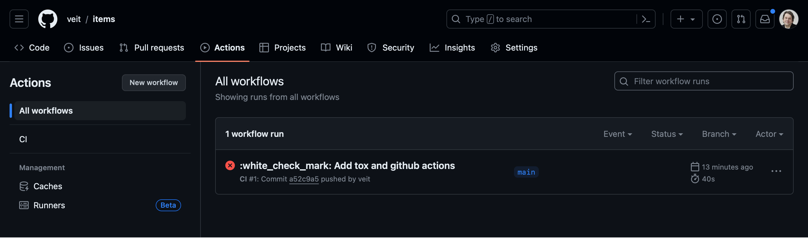
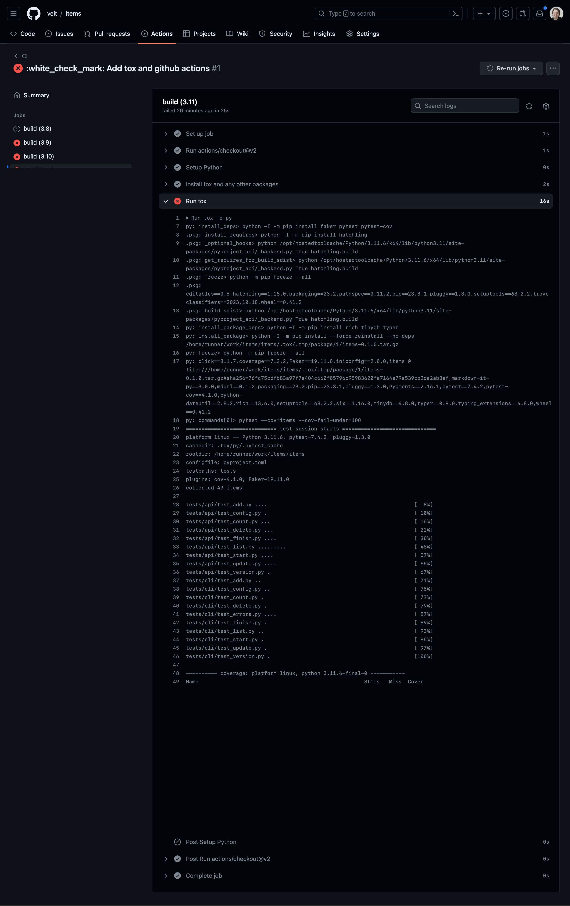

tox
===

`tox <https://tox.readthedocs.io/>`_ is an automation tool that works similarly
to a :term:`CI` tool, but can be run both locally and in conjunction with other
CI tools on a server.

In the following, we will set up tox for our Items application so that it helps
us with local testing. We will then set up testing using GitHub Actions.

Introduction to tox
-------------------

tox is a command line tool that allows you to run your complete test suite in
different environments. We will use tox to test the Items project in multiple
Python versions, but tox is not limited to Python versions only. You can use it
to test with different dependency configurations and different configurations for
different operating systems. tox uses project information from the
:file:`setup.py` or :file:`pyproject.toml` file for the package under test to
create an installable :doc:`distribution of your package <../libs/distribution>`.
It searches the :file:`tox.ini` file for a list of environments and then performs
the following steps for each:

#. creates a :term:`virtual environment <Virtual environment>`,
#. installs some dependencies with :term:`pip`,
#. build your package,
#. install your package with pip,
#. run further tests.

After all environments have been tested, tox outputs a summary of the results.

.. note::
   Although tox is used by many projects, there are alternatives that fulfil
   similar functions. Two alternatives to tox are `nox
   <https://nox.thea.codes/en/stable/>`_ and `invoke
   <https://www.pyinvoke.org>`_.

Setting up tox
--------------

Until now, we had the items code in a :file:`src/` directory and the tests in
:file:`tests/api/` and :file:`tests/cli/`. Now we will add a :file:`tox.ini` file
so that the structure looks like this:

.. code-block:: console
   :emphasize-lines: 16

    items
     ├── …
     ├── pyproject.toml
     ├── src
     │   └── items
     │       └── …
     ├── tests
     │   ├── api
     │   │   ├── __init__.py
     │   │   ├── conftest.py
     │   │   └── test_….py
     │   └── cli
     │       ├── __init__.py
     │       ├── conftest.py
     │       └── test_….py
     └── tox.ini

This is a typical layout for many projects. Let’s take a look at a simple
:file:`tox.ini` file in the Items project:

.. code-block:: ini

   [tox]
   envlist = py311
   isolated_build = True

   [testenv]
   deps =
     pytest>=6.0
     faker
   commands = pytest

In the ``[tox]`` section, we have defined ``envlist = py311``. This is a shortcut
that tells tox to run our tests with Python version 3.11. We will be adding more
Python versions shortly, but using one version helps to understand the flow of
tox.

Also note the line ``isolated_build = True``: This is required for all packages
configured with :file:`pyproject.toml`. However, for all projects configured with
:file:`setup.py` that use the :term:`setuptools` library, this line can be
omitted.

In the ``[testenv]`` section, ``pytest`` and ``faker`` are listed as dependencies
under ``deps``. So tox knows that we need these two tools for testing. If you
wish, you can also specify which version should be used, for example
``pytest>=6.0``. Finally, commands instruct tox to execute ``pytest`` in every
environment.

Executing tox
-------------

Before you can run tox, you must ensure that you have installed it:

.. tab:: Linux/macOS

   .. code-block:: console

      $ python3 -m venv .
      $ . bin/acitvate
      $ python -m pip install tox

.. tab:: Windows

   .. code-block:: ps1con

      C:> python -m venv .
      C:> Scripts\activate
      C:> python -m pip install tox

To run tox, simply start tox:

.. code-block:: pytest

    $ tox
    .pkg: _optional_hooks> python /PATH/TO/items/lib/python3.11/site-packages/pyproject_api/_backend.py True hatchling.build
    .pkg: get_requires_for_build_sdist> python PATH/TO/items/lib/python3.11/site-packages/pyproject_api/_backend.py True hatchling.build
    .pkg: build_sdist> python PATH/TO/items/lib/python3.11/site-packages/pyproject_api/_backend.py True hatchling.build
    py311: install_package> python -I -m pip install --force-reinstall --no-deps PATH/TO/items/.tox/.tmp/package/14/items-0.1.0.tar.gz
    py311: commands[0]> pytest
    ============================= test session starts ==============================
    ...
    configfile: pyproject.toml
    testpaths: tests
    plugins: Faker-19.11.0
    collected 49 items

    tests/api/test_add.py ....                                               [  8%]
    tests/api/test_config.py .                                               [ 10%]
    tests/api/test_count.py ...                                              [ 16%]
    tests/api/test_delete.py ...                                             [ 22%]
    tests/api/test_finish.py ....                                            [ 30%]
    tests/api/test_list.py .........                                         [ 48%]
    tests/api/test_start.py ....                                             [ 57%]
    tests/api/test_update.py ....                                            [ 65%]
    tests/api/test_version.py .                                              [ 67%]
    tests/cli/test_add.py ..                                                 [ 71%]
    tests/cli/test_config.py ..                                              [ 75%]
    tests/cli/test_count.py .                                                [ 77%]
    tests/cli/test_delete.py .                                               [ 79%]
    tests/cli/test_errors.py ....                                            [ 87%]
    tests/cli/test_finish.py .                                               [ 89%]
    tests/cli/test_list.py ..                                                [ 93%]
    tests/cli/test_start.py .                                                [ 95%]
    tests/cli/test_update.py .                                               [ 97%]
    tests/cli/test_version.py .                                              [100%]

    ============================== 49 passed in 0.08s ==============================
    .pkg: _exit> python /PATCH/TO/items/lib/python3.11/site-packages/pyproject_api/_backend.py True hatchling.build
      py311: OK (1.48=setup[1.21]+cmd[0.27] seconds)
      congratulations :) (1.51 seconds)

Testing multiple Python versions
--------------------------------

To do this, we extend ``envlist`` in the :file:`tox.ini` file to add further
Python versions:

.. code-block:: ini
   :emphasize-lines: 2, 4

   [tox]
   envlist = py38, py39, py310, py311
   isolated_build = True
   skip_missing_interpreters = True

We will now test Python versions from 3.8 to 3.11. In addition, we have also
added the setting ``skip_missing_interpreters = True`` so that tox does not fail
if one of the listed Python versions is missing on your system. If the value is
set to ``True``, tox will run the tests with every available Python version, but
will skip versions it doesn’t find without failing. The output is very similar,
although I will only highlight the differences in the following illustration:

.. code-block:: pytest
   :emphasize-lines: 2, 4, 10, 12, 18-

    $ tox
    py38: skipped because could not find python interpreter with spec(s): py38
    py38: SKIP ⚠ in 2.13 seconds
    py39: install_package> python -I -m pip install --force-reinstall --no-deps /PATCH/TO/items/.tox/.tmp/package/15/items-0.1.0.tar.gz
    py39: commands[0]> pytest
    ============================= test session starts ==============================
    ...
    ============================== 49 passed in 0.16s ==============================
    py39: OK ✔ in 8.08 seconds
    py310: skipped because could not find python interpreter with spec(s): py310
    py310: SKIP ⚠ in 0 seconds
    py311: install_package> python -I -m pip install --force-reinstall --no-deps /PATH/TO/items/.tox/.tmp/package/16/items-0.1.0.tar.gz
    py311: commands[0]> pytest
    ============================= test session starts ==============================
    ...
    ============================== 49 passed in 0.09s ==============================
    .pkg: _exit> python /PYTH/TO/items/lib/python3.11/site-packages/pyproject_api/_backend.py True hatchling.build
      py38: SKIP (2.13 seconds)
      py39: OK (8.08=setup[6.92]+cmd[1.16] seconds)
      py310: SKIP (0.00 seconds)
      py311: OK (1.24=setup[0.95]+cmd[0.29] seconds)
      congratulations :) (11.48 seconds)

Running Tox environments in parallel
------------------------------------

In the previous example, the different environments were executed one after the
other. It is also possible to run them in parallel with the ``-p`` option:

.. code-block:: pytest

    $ tox -p
    py38: SKIP ⚠ in 0.02 seconds
    py310: SKIP ⚠ in 0.29 seconds
    py311: OK ✔ in 1.53 seconds
      py38: SKIP (0.02 seconds)
      py39: OK (2.21=setup[1.88]+cmd[0.33] seconds)
      py310: SKIP (0.29 seconds)
      py311: OK (1.53=setup[1.24]+cmd[0.29] seconds)
      congratulations :) (2.24 seconds)

.. note::
   The output is not abbreviated; this is the full output you will see if
   everything works.

Add coverage report in tox
--------------------------

The configuration of coverage reports can easily be added to the :file:`tox.ini`
file. To do this, we need to add ``pytest-cov`` to the ``deps`` settings so that
the ``pytest-cov`` plugin is installed in the tox test environments. Including
``pytest-cov`` also includes all its dependencies, such as ``coverage``. We then
extend commands to ``pytest --cov=items``:

.. code-block::
   :emphasize-lines: 10-

   [tox]
   envlist = py38, py39, py310, py311
   isolated_build = True
   skip_missing_interpreters = True

   [testenv]
   deps =
     pytest
     faker
     pytest-cov
   commands = pytest --cov=items

When using Coverage with tox, it can sometimes be useful to set up a
:file:`.coveragerc` file to tell Coverage which source code paths should be
considered identical:

.. code-block:: ini

    [paths]
    source =
       src
       .tox/*/site-packages

The items source code is initially located in :file:`src/items/` before tox
creates the virtual environments and installs items in the environment. It is
then located in :file:`.tox/py311/lib/python3.11/site-packages/items`, for
example.

.. code-block:: pytest
   :emphasize-lines: 1

    $ tox -e py311
    ...
    py311: commands[0]> pytest --cov=items
    ...
    ---------- coverage: platform darwin, python 3.11.5-final-0 ----------
    Name                                                        Stmts   Miss  Cover
    -------------------------------------------------------------------------------
    .tox/py311/lib/python3.11/site-packages/items/__init__.py       3      0   100%
    .tox/py311/lib/python3.11/site-packages/items/api.py           68      1    99%
    .tox/py311/lib/python3.11/site-packages/items/cli.py           86      0   100%
    .tox/py311/lib/python3.11/site-packages/items/db.py            23      0   100%
    -------------------------------------------------------------------------------
    TOTAL                                                         180      1    99%

    ============================== 49 passed in 0.17s ==============================
    ...
      py311: OK (1.85=setup[1.34]+cmd[0.51] seconds)
      congratulations :) (1.89 seconds)

.. note::
   We have used the ``-e py311`` option here to select a specific environment.

Set minimum coverage
--------------------

When executing coverage by tox, it also makes sense to define a minimum coverage
level in order to recognise any coverage failures. This is achieved with the
``--cov-fail-under`` option:

.. code-block:: ini
   :emphasize-lines: 11

   [tox]
   envlist = py38, py39, py310, py311
   isolated_build = True
   skip_missing_interpreters = True

   [testenv]
   deps =
     pytest
     faker
     pytest-cov
   commands = pytest --cov=items --cov-fail-under=100

This adds an additional line to the output:

.. code-block:: pytest
   :emphasize-lines: 15

    $ tox -e py311
    ...
    ============================= test session starts ==============================
    ...
    ---------- coverage: platform darwin, python 3.11.5-final-0 ----------
    Name                                                        Stmts   Miss  Cover
    -------------------------------------------------------------------------------
    .tox/py311/lib/python3.11/site-packages/items/__init__.py       3      0   100%
    .tox/py311/lib/python3.11/site-packages/items/api.py           68      1    99%
    .tox/py311/lib/python3.11/site-packages/items/cli.py           86      0   100%
    .tox/py311/lib/python3.11/site-packages/items/db.py            23      0   100%
    -------------------------------------------------------------------------------
    TOTAL                                                         180      1    99%

    FAIL Required test coverage of 100% not reached. Total coverage: 99.44%

    ============================== 49 passed in 0.16s ==============================
    py311: exit 1 (0.43 seconds) /PATH/TO/items> pytest --cov=items --cov-fail-under=100 pid=58109
    .pkg: _exit> python /PATH/TO/items/lib/python3.11/site-packages/pyproject_api/_backend.py True hatchling.build
      py311: FAIL code 1 (1.65=setup[1.22]+cmd[0.43] seconds)
      evaluation failed :( (1.68 seconds)

.. _posargs:

Passing pytest parameters to tox
--------------------------------

We can also call individual tests with tox by making another change so that
parameters can be passed to pytest:

.. code-block:: ini
   :emphasize-lines: 11

    [tox]
    envlist = py38, py39, py310, py311
    isolated_build = True
    skip_missing_interpreters = True

    [testenv]
    deps =
      pytest
      faker
      pytest-cov
    commands = pytest --cov=items --cov-fail-under=100  {posargs}

To pass arguments to pytest, insert them between the tox arguments and the pytest
arguments. In this case, we select ``test_version`` tests with the ``-k`` keyword
option. We also use ``--no-cov`` to disable coverage:

.. code-block:: pytest
   :emphasize-lines: 1, 3

    $ tox -e py311 -- -k test_version --no-cov
    ...
    py311: commands[0]> pytest --cov=items --cov-fail-under=100 -k test_version --no-cov
    ============================= test session starts ==============================
    ...
    configfile: pyproject.toml
    testpaths: tests
    plugins: cov-4.1.0, Faker-19.11.0
    collected 49 items / 47 deselected / 2 selected

    tests/api/test_version.py .                                              [ 50%]
    tests/cli/test_version.py .                                              [100%]

    ======================= 2 passed, 47 deselected in 0.04s =======================
    .pkg: _exit> python /PATH/TO/items/lib/python3.11/site-packages/pyproject_api/_backend.py True hatchling.build
      py311: OK (1.51=setup[1.25]+cmd[0.26] seconds)
      congratulations :) (1.53 seconds)

tox is not only ideal for the local automation of test processes, but also helps
with server-based :term:`CI`. Let’s continue with the execution of pytest and tox
using GitHub actions.

Running tox with GitHub actions
-------------------------------

If your project is hosted on `GitHub <https://github.com/>`_, you can use GitHub
actions to automatically run your tests in different environments. A whole range
of environments are available for GitHub actions:
`github.com/actions/virtual-environments
<https://github.com/actions/virtual-environments/#readme>`_.

#. To create a GitHub action in your project, click on :menuselection:`Actions
   --> set up a workflow yourself`. This usually creates a
   :file:`.github/workflows/main.yml` file.
#. Give this file a more descriptive name. We usually use :file:`ci.yml` for
   this.
#. The prefilled YAML file is not very helpful for our purposes. You can replace
   the text, for example with:

   .. code-block:: yaml

      name: CI
      on: [push, pull_request]
      jobs:
        build:
          runs-on: ubuntu-latest
          strategy:
            matrix:
              python: ["3.8", "3.9", "3.10", "3.11"]
          steps:
            - uses: actions/checkout@v2
            - name: Setup Python
              uses: actions/setup-python@v2
              with:
                python-version: ${{ matrix.python }}
            - name: Install tox and any other packages
              run: python -m pip install tox tox-gh-actions
            - name: Run tox for "${{ matrix.python }}"
              run: python -m tox

   ``name``
       can be any name. It is displayed in the GitHub Actions user interface.
   ``on: [push, pull_request]``
       instructs Actions to run our tests every time we either push code to the
       repository or a pull request is created. In the case of pull requests, the
       result of the test run can be viewed in the pull request interface. All
       results of the GitHub actions can be seen on the GitHub user interface.
   ``runs-on: ubuntu-latest``
       specifies the operating system on which the tests are to be executed. Here
       the tests only run on Linux, but other operating systems are also
       available.
   ``matrix: python: ["3.8", "3.9", "3.10", "3.11"]``
       specifies which Python version is to be executed.
   ``steps``
       is a list of steps. The name of each step can be arbitrary and is
       optional.
   ``uses: actions/checkout@v2``
       is a GitHub actions tool that checks out our repository so that the rest
       of the workflow can access it.
   ``uses: actions/setup-python@v2``
       is a GitHub actions tool that configures Python and installs it in a build
       environment.
   ``with: python-version: ${{ matrix.python }}``
       says that an environment should be created for each of the Python versions
       listed in ``matrix.python``.
   ``run: python -m pip install tox tox-gh-actions``
       installs tox and simplifies the execution of tox in GitHub actions with
       `tox-gh-actions <https://pypi.org/project/tox-gh-actions/>`_ by providing
       the environment that tox itself uses as the environment for the tests.
       However, we still need to adjust our :file:`tox.ini` file for this, for
       example:

       .. code-block:: ini

          [gh-actions]
          python =
              3.8: py38
              3.9: py39
              3.10: py310
              3.11: py311

       This assigns GitHub actions to tox environments.

       .. note::
          * You do not need to specify all variants of your environment. This
            distinguishes ``tox-gh-actions`` from ``tox -e py``.
          * Make sure that the versions in the ``[gh-actions]`` section match the
            available Python versions and, if applicable, those in the
            :ref:`GitHub actions for Git pre-commit hooks
            <gh-action-pre-commit-example>`.
          * Since all tests for a specific Python version are executed one after
            the other in a container, the advantages of parallel execution are
            lost.

   ``run: python -m tox``
       executes tox.

#. You can then click on :guilabel:`Start commit`. As we want to make further
   changes before the tests are executed automatically, we select
   :guilabel:`Create a new branch for this commit and start a pull request` and
   github-actions as the name for the new :term:`branch <branch>`. Finally, you
   can click on :guilabel:`Create pull request`.
#. To switch to the new branch, we go to :menuselection:`Code --> main -->
   github-actions`.

The actions syntax is well documented. A good starting point in the GitHub
Actions documentation is the `Building and Testing Python
<https://docs.github.com/en/actions/automating-builds-and-tests/building-and-testing-python>`_
page. The documentation also shows you how to run pytest directly without tox and
how to extend the matrix to multiple operating systems. As soon as you have set
up your :file:`*.yml` file and uploaded it to your GitHub repository, it will be
executed automatically. You can then see the runs in the :menuselection:`Actions`
tab:

The different Python environments are listed on the left-hand side. If you select
one, the results for this environment are displayed, as shown in the following
screenshot:

.. seealso::
   * `Building and testing Python
     <https://docs.github.com/en/actions/automating-builds-and-tests/building-and-testing-python>`_
   * `Workflow syntax for GitHub Actions
     <https://docs.github.com/en/actions/using-workflows/workflow-syntax-for-github-actions>`_

Display badge
-------------

Now you can add a badge of your :term:`CI` status to your :file:`README.rst`
file, for example with:

.. code-block::

   .. image:: https://github.com/YOU/YOUR_PROJECT/workflows/CI/badge.svg?branch=main
      :target: https://github.com/YOU/YOUR_PROJECT/actions?workflow=CI
      :alt: CI Status

Publish test coverage
---------------------

You can publish the test coverage on GitHub, see also :ref:`Coverage
GitHub-Actions <coverage-github-actions>`.

Extend tox
----------

tox uses `pluggy <https://pluggy.readthedocs.io/en/stable/>`_ to customise the
default behaviour. Pluggy finds a plugin by searching for an entry point with the
name ``tox``, for example in a :file:`pyproject.toml` file:

.. code-block:: toml

    [project.entry-points.tox]
    my_plugin = "my_plugin.hooks"

To use the plugin, it therefore only needs to be installed in the same
environment in which tox is running and it is found via the defined entry point.

A plugin is created by implementing extension points in the form of hooks. For
example, the following code snippet would define a new ``--my`` :abbr:`CLI
(Command Line Interface)`:

.. code-block:: python

    from tox.config.cli.parser import ToxParser
    from tox.plugin import impl

    @impl
    def tox_add_option(parser: ToxParser) -> None:
        parser.add_argument("--my", action="store_true", help="my option")

.. seealso::
   * `Extending tox <https://tox.readthedocs.io/en/latest/plugins.html>`_
   * `tox development team <https://github.com/orgs/tox-dev/repositories>`_
